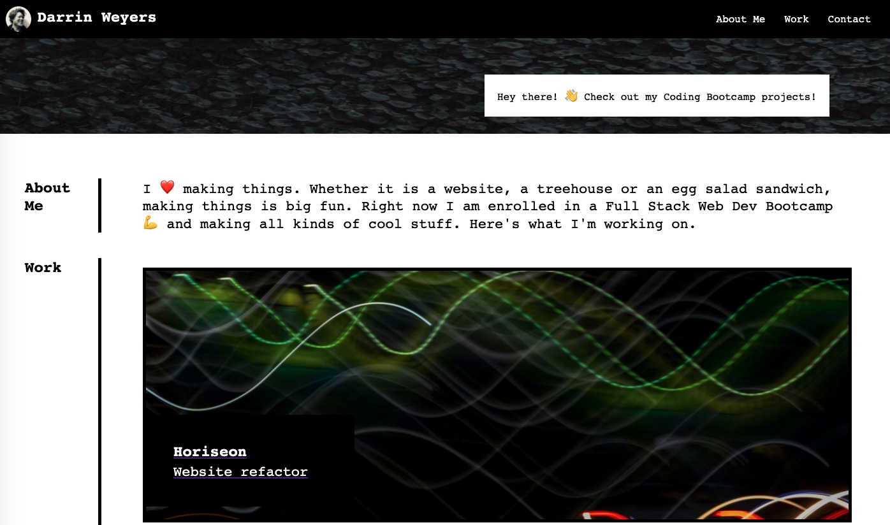

# Class Portfolio

## Deployed Application
[Class Portfolio](https://darrindevs.github.io/class-portfolio/)

## Summary 
This project is a portfolio of work from my Coding Bootcamp course. 

It was created from scratch and uses advanced CSS skills such as flexbox, media queries and CSS variables. Take a look at it on different screeen sizes to see how the application transforms. 

The site is optimized for search engines through the application of accessibility standards using semantic HTML elements, accessible alt attributes, sequential heading attributes and a concise, descriptive title.

The stylesheet has been thoroughly commented to provide the reader with a clear organization of the semantic elements and overview of refactored code. 

## Technologies Used
- 🦴 HTML - Hypertext Markup Language is the standard markup language for documents designed to be displayed in a web browser.
- 👗 CSS - Cascading Style Sheets is a style sheet language used for describing the presentation of a document written in a markup language such as HTML. 
- ☑️ Git - Git is software for tracking changes in any set of files, usually used for coordinating work among programmers collaboratively developing source code during software development.
- ⛅️ GitHub - GitHub, Inc. is a provider of Internet hosting for software development and version control using Git.
- 🧩 Balsamiq - Balsamiq is a low-fidelity wireframing tool.

## Code Snippet

    <section id="work-5" class="box">
        <!-- make the image a link-->
        <a class="project-link" href="#">
            

                

                    <h2 class="project-title">Awesome Project</h2>
                        
Coming Soon!

                
    
            

        </a>
    </section>

## Notes

- Fully responsive

## Author Links
[LinkedIn](https://www.linkedin.com/in/darrinweyers/)
[GitHub](https://github.com/darrindevs)
